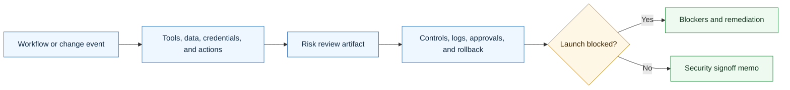

# Agentic Security Review Skill

<p align="center">
  
</p>

A CompleteTech LLC Codex skill for creating security, safety, permissions, and production-readiness review artifacts for agentic development workflows.

## About

Part of the CompleteTech LLC agentic services skill library. This skill creates practical review artifacts for permissions, data exposure, credentials, tools, retrieval, external actions, launch risk, rollback, and incident response.

## Workflow Diagram



## What It Does

- Selects the right review artifact by launch event, tool change, data exposure, credential change, retrieval source, external action, incident, or signoff need.
- Drafts risk intakes, permission inventories, secrets checklists, data exposure reviews, prompt-injection test plans, retrieval trust reviews, approval audits, external action reviews, logging reviews, model/provider reviews, retention reviews, dependency reviews, least-privilege checklists, launch blockers, rollback plans, incident plans, escalation procedures, red-team reports, and signoff memos.
- Keeps reviews practical, bounded, auditable, and implementation-focused.
- Helps an agent identify when human approval, client approval, or technical escalation is required.

## Contents

- `SKILL.md` - operating instructions and artifact-selection guide.
- `references/security-catalog.md` - reusable security review artifact templates.
- `references/use-case-decision-table.md` - quick guide for choosing the right artifact.
- `references/security-lifecycle.md` - flow from intake through launch, change review, and post-incident follow-up.
- `references/security-positioning.md` - CompleteTech LLC security language and guardrails.
- `references/template-index.json` - machine-readable artifact metadata.
- `scripts/render_security_review.py` - deterministic artifact listing and rendering helper.

## Quick Start

```bash
python3 scripts/render_security_review.py --list
python3 scripts/render_security_review.py \
  --template agentic-risk-intake \
  --var client_name=Acme \
  --var workflow="support triage agent"
```

Rendered artifacts are drafts. Replace placeholders with verified workflow, data, tool, permission, credential, approval, logging, rollback, and incident-response details before use.

## Brand Notes

Use a direct, concrete, low-hype tone. Present security review as practical risk reduction for bounded agentic workflow implementation: name the access, verify the evidence, protect human approvals, limit permissions, document logs, define rollback, and make launch blockers explicit. Do not claim formal compliance, certification, legal approval, penetration-test completion, production readiness, or guaranteed security unless verified evidence is provided.

## License

Code, templates, and documentation are licensed under the MIT License. CompleteTech LLC names, logos, seals, and brand assets are reserved and are not licensed for reuse except to identify this project. See `LICENSE` and `BRAND_ASSETS.md`.
